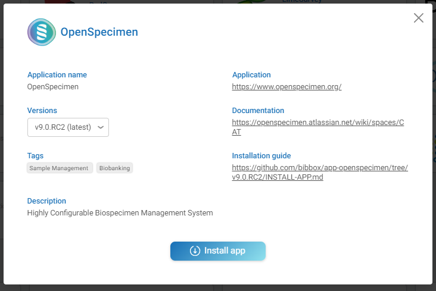
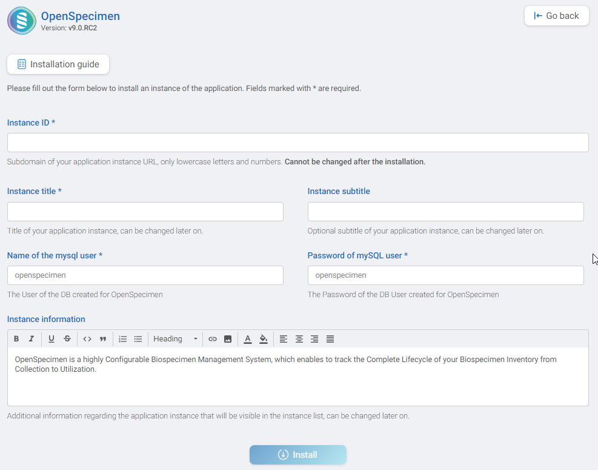

# APP-OPENSPECIMEN Installation Instructions 

The application can be installed either within the BIBBOX environment or as a stand-alone solution. Installation instructions can be found within the BIBBOX, followed by setup instructions required once the application has been successfully installed.

## Installation within in the BIBBOX

Once you've selected the desired App for your BIBBOX instance, you can choose from the available versions, as shown in the following figure.

Clicking "Install" will open a new window, as illustrated in the following figure. Here, you can define the necessary entries. Some fields come pre-filled with suggested options, and if left unchanged, these default values will be used as the entries.

After confirming by clicking "Install," the App will be installed as a BIBBOX instance. Once the installation is complete, you only need to follow a few steps to use the App for the first time, which are described below.

## Setup after BIBBOX or stand-alone installation

* Install the application from BIBBOX store
* Wait for installation to finish
* After installation in BIBBOX, Open Specimen will take some minutes to set up internally
* Start the application from BIBBOX application screen
* Log into Open Specimen with user "admin" and password "Login@123"

* After Open Specimen has finished its internal setup process, den Login screen can be accessed. (This can take several minutes)

* After logging into the application, the user will have access to the Open Specimen dashboard and the application is ready to user
* Don't forget to change the default access credentials!

## After the installation

Have a nice ride with the new Admins youngtimer.

