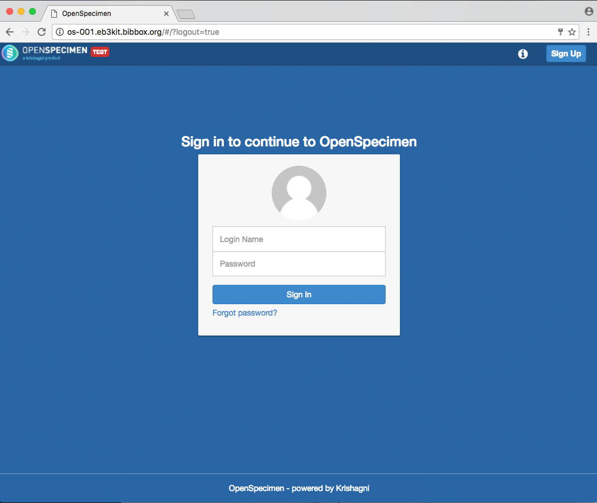
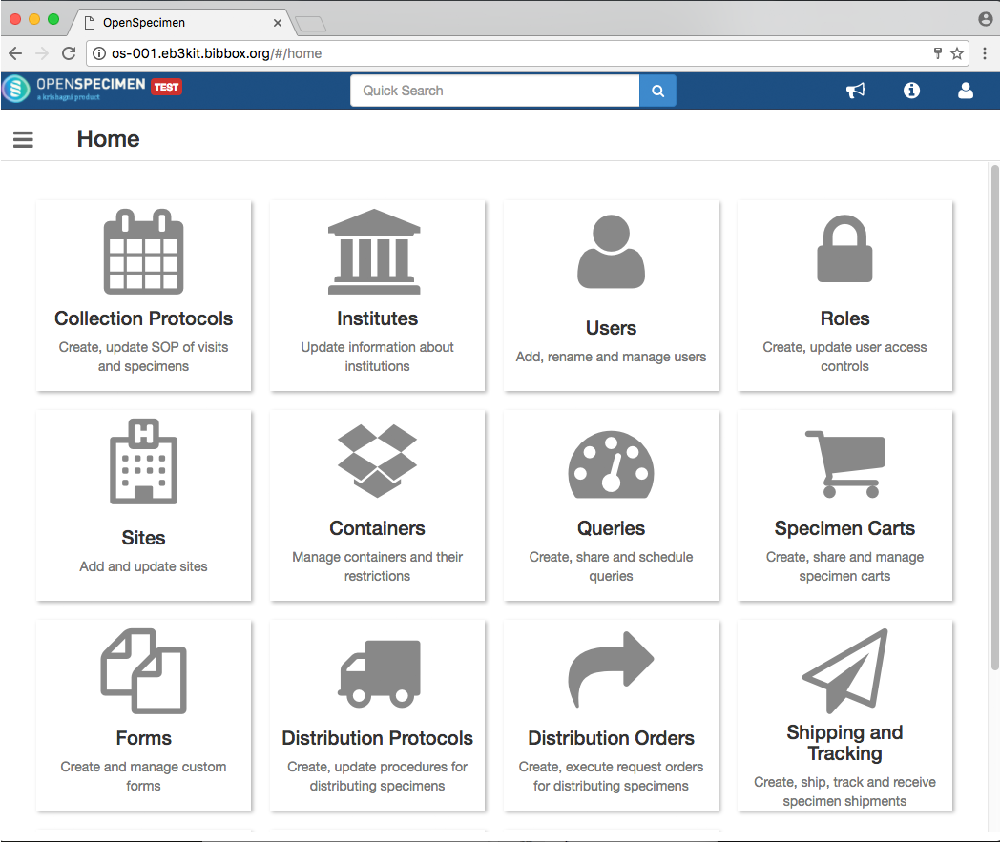

## APP-OPENSPECIMEN Installation Instructions 

* Install the application from BIBBOX store
* Wait for installation to finish
* After installation in BIBBOX, Open Specimen will take some minutes to set up internally
* Start the application from BIBBOX application screen
* Log into Open Specimen with user "bibboxadmin" and password "Login!@3"

* After Open Specimen has finished its internal setup process, den Login screen can be accessed. (This can take several minutes)

* After logging into the application, the user will have access to the Open Specimen dashboard and the application is ready to user
* Don't forget to change the default access credentials!

## After the installation

Have a nice ride with the new Admins youngtimer.

