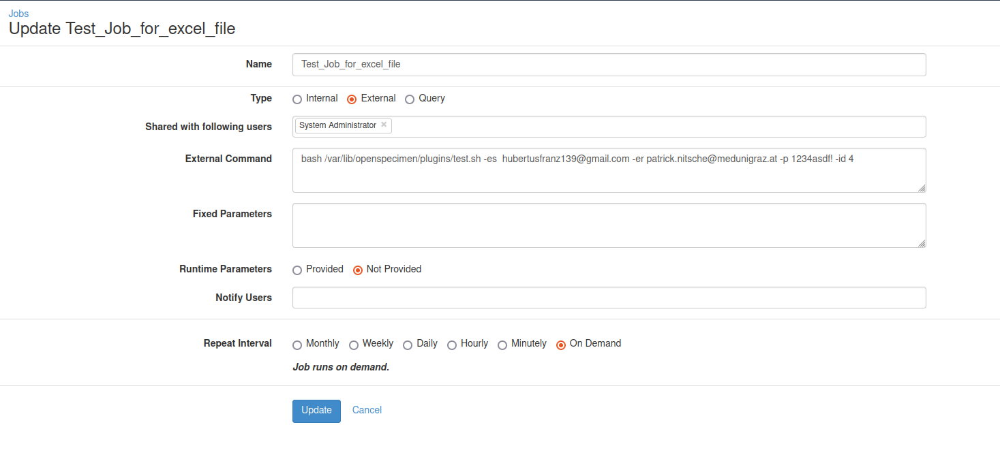

## BBMRI directory forms plugin

Files for creating an external job in Openspecimen and Extracting an BBMRI directory conform EMX file.

### The files need to be placed such that openspecimen can access them. The Forms corresponding to the extractor can be found here:

- For the collection protocoll extension use *[Collection protocol extension form](https://github.com/bibbox/os-extensions/blob/master/BBMRI_Directory_Forms/src/main/resources/entity-forms/collectionProtocol_extension.xml)*.
- For the site extension use this file *[Site Extension Form](https://github.com/bibbox/os-extensions/blob/master/BBMRI_Directory_Forms/src/main/resources/entity-forms/site_extension.xml)*.

For the Job to create see the example job and see https://openspecimen.atlassian.net/wiki/spaces/CAT/pages/56492042/Jobs for general information on external jobs.



- In the example image the files found in ./data/os-plugins/ are placed in "/var/lib/openspecimen/plugins/"
- The job exectutes a bash script which in turn starts a python script so please make sure a python interpreter is available to be called at python3.
- It passes the parameters towards the python script and expects an smpt email server to be present and set in the python file.

You can do this within the exports.py file see:

```
context = ssl.create_default_context()
with smtplib.SMTP_SSL(<your-server-here>, 465, context=context) as server:
subject = "Directory Update"
body = "Diese wichtige Nachricht spamt dich mit EMX files für das directory !"
```

- Default value for <your-server-here> is "smtp.gmail.com"
- Default message test can also be set within the python script see within export.py
  
Should you not need any Email sending just delete all the content below line 64 in exports.py. In this case you can just fetch the file next to where you placed your python script
  
The parameters are as follows:

--er "${EMAILRECEIVER}"  --es "${EMAILSENDER}" --p "${PASSWORD}" --id "${ID}"
  
- The file will be right in the directory next to your python script named "test.xlxs" and does not require the E-mail to be sent.
- This file contains the information which can then be sent towards the BBMRI team and can be imported into the directory to update a set BIOBANK collection there.
